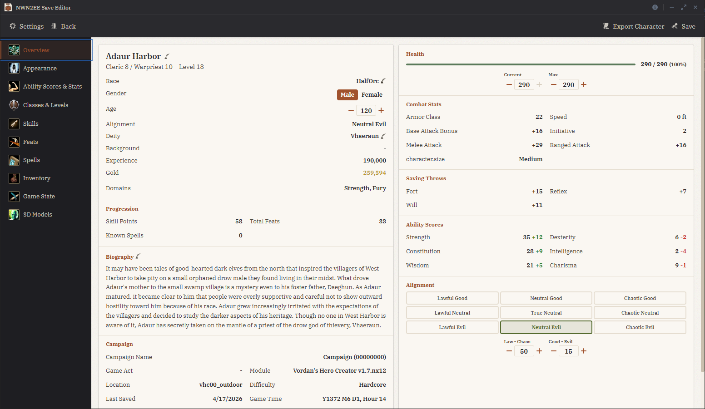
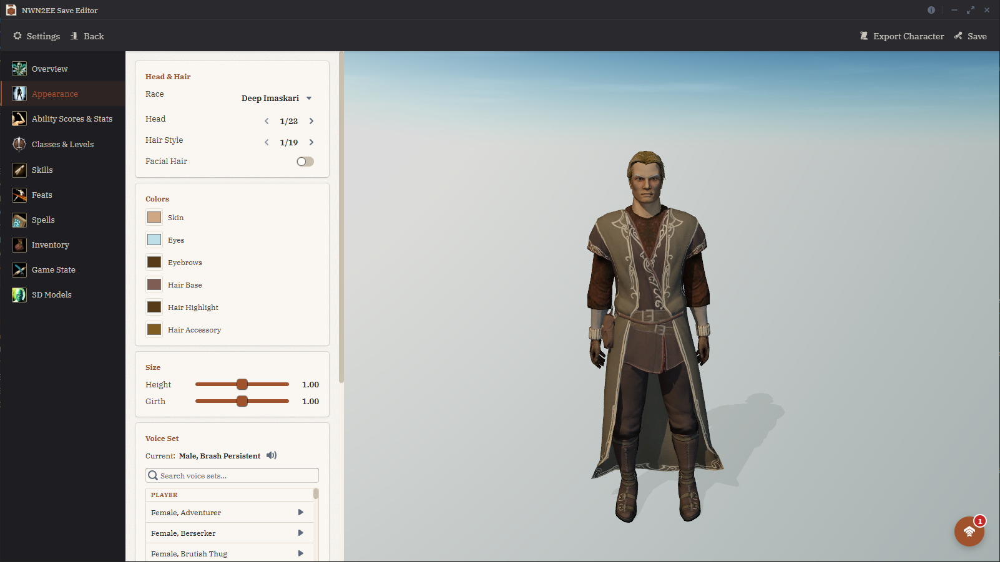
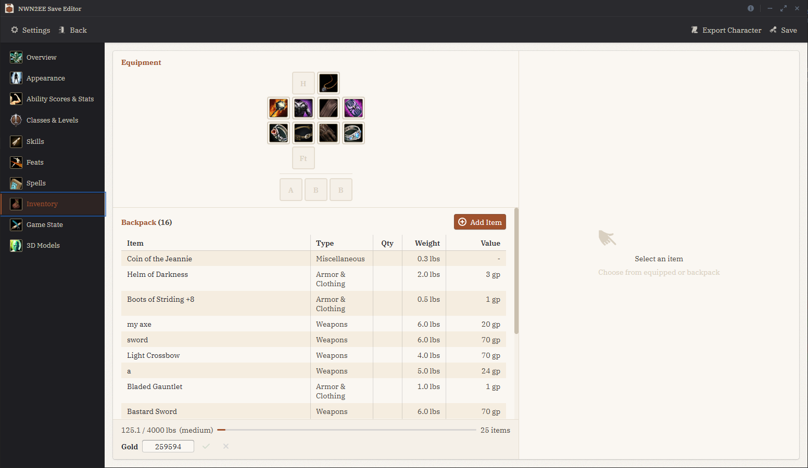
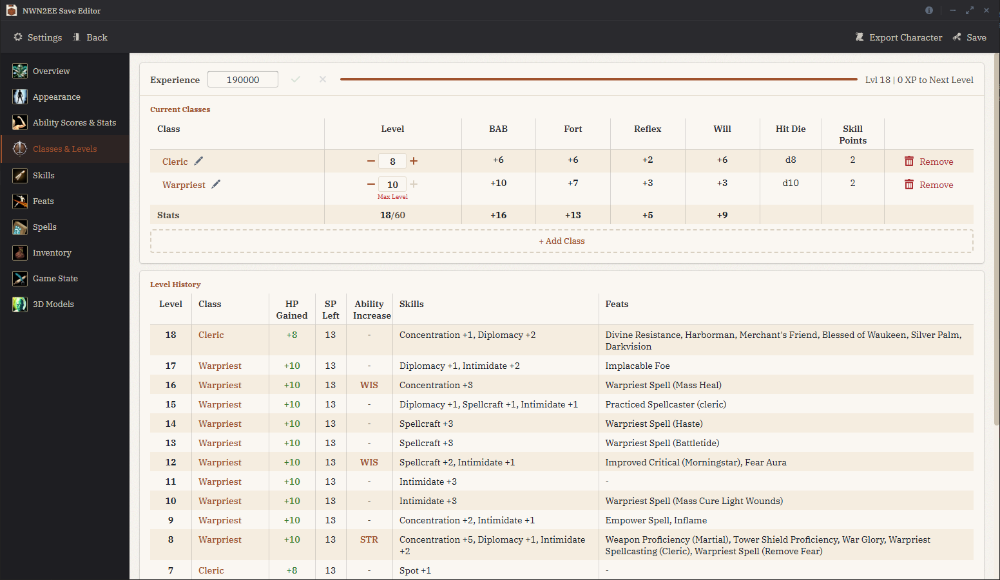
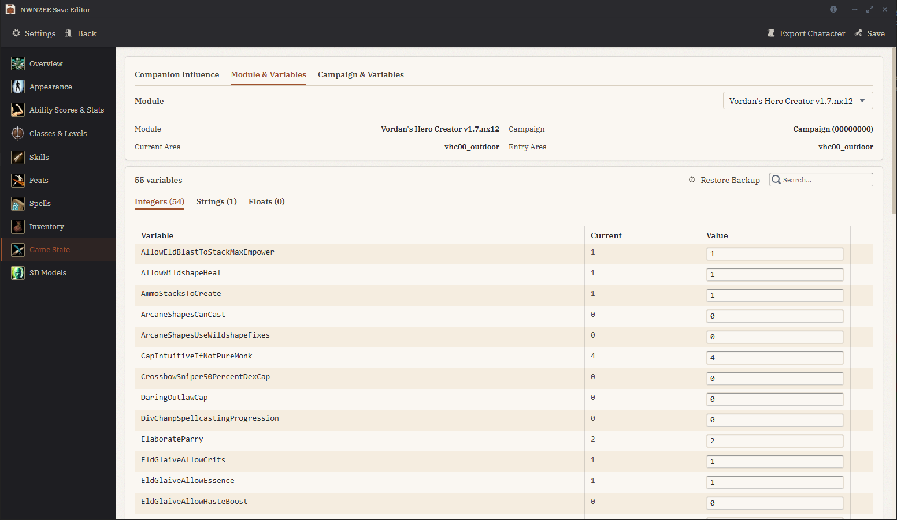
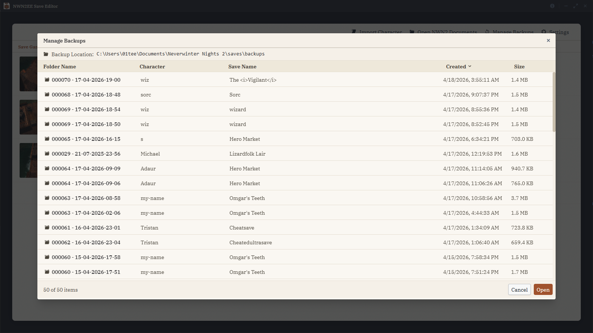
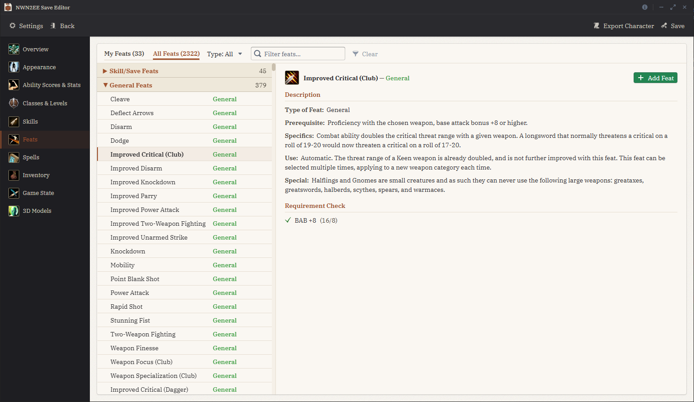

<h1 align="center">NWN2 Enhanced Edition Save Editor</h1>

<p align="center">
  A desktop application for editing Neverwinter Nights 2 Enhanced Edition saves.<br/>
  Built with Tauri, Rust, and Vite. Fully offline, available as a portable <code>.exe</code> or installer.
</p>

<p align="center">
  <a href="https://github.com/Micromanner/nwn2-ee-save-editor/releases/latest"></a>
  <a href="https://github.com/Micromanner/nwn2-ee-save-editor/releases"></a>
  <a href="LICENSE"></a>
  
  <a href="https://github.com/Micromanner/nwn2-ee-save-editor/stargazers"></a>
</p>

<p align="center">
  <a href="https://github.com/Micromanner/nwn2-ee-save-editor/releases/latest"></a>
  <a href="https://github.com/Micromanner/nwn2-ee-save-editor/releases/latest"></a>
</p>

<p align="center">
  
</p>

## Contents

- [Features](#features)
- [Screenshots](#screenshots)
- [Requirements](#requirements)
- [Getting Started](#getting-started)
- [Building from Source](#building-from-source)
- [Roadmap](#roadmap)

## Features

### Character Editing
- **Ability Scores** - Edit base scores with point-buy tracking, view racial modifiers, level bonuses, and equipment bonuses
- **Classes & Levels** - Multiclass management, level history tracking and experience points
- **Feats** - Add/remove feats
- **Skills** - Edit skills with rank allocation, class skill detection, and skill point budgets
- **Spells** - Manage known/memorized spells, domain spells, and spell slot calculations
- **Inventory** - Full equipment management, inventory items, gold, encumbrance, item property editing
- **Race** - Change race with subrace support and automatic stat adjustments
- **Appearance** - Customize body parts, phenotype, wings, tails, and colors with live 3D preview
- **Identity** - Name, biography, alignment, deity, age and gender
- **Combat Stats** - View attack bonuses, armor class, saving throws, and initiative

### Game State
- **Campaign Variables and Settings** - Edit global campaign settings and variables
- **Module Variables** - View and modify module-level state

### Save Management
- Automatic backup creation before every save
- Backup restore with safety snapshots

### Mod Support
- HAK pack override chain
- Steam Workshop integration
- Custom override directories

### 3D Model Viewer
- Browse and preview all in-game 3D models

## Screenshots

<table>
  <tr>
    <td width="50%"><br/><sub><b>Appearance</b> — live 3D preview with body parts, tints, wings, tails</sub></td>
    <td width="50%"><br/><sub><b>Inventory</b> — equipment, item properties, encumbrance</sub></td>
  </tr>
  <tr>
    <td><br/><sub><b>Classes & Levels</b> — multiclass with level history</sub></td>
    <td><br/><sub><b>Game state</b> — campaign and module variables</sub></td>
  </tr>
  <tr>
    <td><br/><sub><b>Backups</b> — automatic safety snapshots and restore</sub></td>
    <td><br/><sub><b>Feats</b> — add/remove with prerequisite checks</sub></td>
  </tr>
</table>

## Requirements

- Windows 10+ / Ubuntu
- Neverwinter Nights 2 Enhanced Edition

## Getting Started

1. Download the latest release
2. Run the `.exe` - game paths are auto-detected
3. Open a save file and start editing

## Building from Source

```bash
# Install dependencies
npm install

# Development
npm run tauri:dev

# Production build
npm run tauri:build
```

Requires:
- Node.js 18+
- Rust toolchain (stable)

## Roadmap

- Companion editing (view, edit, and manage party companions)
- Full equipment rendering in the 3D character preview (some equipped items don't yet display correctly)
- Quest journal editor — browse each quest with its branches and outcomes, see current progress, and jump to any state (today the Game State tab shows the raw values, but not what they mean)
- Custom item icons — pick a different icon for any item in the inventory
